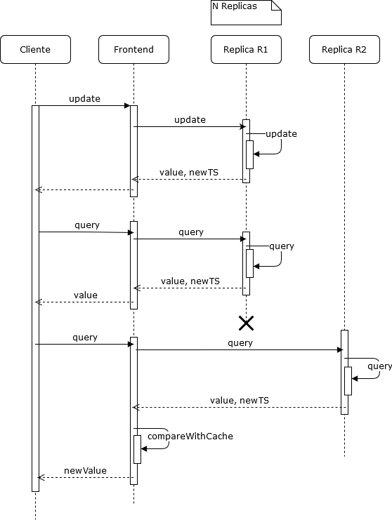

# Relatório do projeto Sauron

Sistemas Distribuídos 2019-2020, segundo semestre

## Autores
  
**Grupo T01**

| Número | Nome              | Utilizador                       | Correio eletrónico                                    |
| -------|-------------------|----------------------------------| ------------------------------------------------------|
| 83609  | Inês Morais       | <https://github.com/inesqmorais> | <mailto:ines.q.morais@tecnico.ulisboa.pt>             |
| 87668  | João Antunes		 | <https://github.com/jcja>	    | <mailto:joao.c.jeronimo.antunes@tecnico.ulisboa.pt>   |

   

## Melhorias da primeira parte

- Correção testes de integração desenvolvidos: Completámos os testes que não cobriam casos suficientes
 
	[CamInfoIT: Adição do teste CameraDoesNotExistsTest (linhas 61 à 79)
	](https://github.com/tecnico-distsys/T01-Sauron/commit/850473aff0e350a5fb814b75ea2b57ca2a0c8852#diff-c6f5f92ad2f871dc6d9e30b60f98364d)
	
	[ReportIT: Adição dos testes incorrectPersonId, incorrectCarPlate (linhas 78 à 175)
	](https://github.com/tecnico-distsys/T01-Sauron/commit/1a5201dd9a5126028f058c98f1fca97e64d8ba8a#diff-eb5de391e68011ade5ca22893a8a1a46)
	
	[TrackIT: Adição dos testes 
	    OnlyOneCarOccurrenceTrackTest, 
        VariousCarOccurrencesTrackTest, 
        NoOccurrencesCarTrackTest, 
	    OnlyOnePersonOccurrenceTrackTest, 
	    VariousPersonOccurrencesTrackTest, 
	    NoOccurrencesPersonTrackTest,
	    NoRealTypeTrackTest (linhas 19 à 215)
	    ](https://github.com/tecnico-distsys/T01-Sauron/commit/1a5201dd9a5126028f058c98f1fca97e64d8ba8a#diff-3a9ac125123254f069c9da6a7c683733)
	
	[TrackIT: Adição dos testes 
	    MostRecentCarOccurrenceTrackTest, 
	    MostRecentCarDifferentCameraOccurrenceTrackTest (linhas 96 a 210), 
	    MostRecentPersonOccurrenceTrackTest, 
	    MostRecentPersonDifferentCameraOccurrenceTrackTest (linhas 316 a 430)
	    ](https://github.com/tecnico-distsys/T01-Sauron/commit/850473aff0e350a5fb814b75ea2b57ca2a0c8852#diff-3a9ac125123254f069c9da6a7c683733)
	
	[TrackMatchIT: Adição dos testes 
	    OnlyOneCarOccurrenceTrackMatchTest, 
	    VariousCarOccurrencesTrackMatchTest, 
	    NoCarOccurrencesTrackMatchTest,
	    OnlyOnePersonOccurrenceTrackMatchTest, 
        VariousPersonOccurrencesTrackMatchTest, 
        NoPersonOccurrencesTrackMatchTest, 
	    NoRealTypeOccurrencesTrackMatchTest (linhas 15 a 427)
	    ](https://github.com/tecnico-distsys/T01-Sauron/commit/1a5201dd9a5126028f058c98f1fca97e64d8ba8a#diff-f0b44d37dc357fc4e42e6caab06eb46e)
	
	[TrackMatchIT: Adição dos testes 
	    MostRecentCarOccurrenceTrackTest, 
	    MostRecentCarDifferentCameraOccurrenceTrackTest (linhas 207 a 326), 
	    MostRecentPersonOccurrenceTrackTest, 
	    MostRecentPersonDifferentCameraOccurrenceTrackTest (linhas 528 a 648)
	    ](https://github.com/tecnico-distsys/T01-Sauron/commit/850473aff0e350a5fb814b75ea2b57ca2a0c8852#diff-f0b44d37dc357fc4e42e6caab06eb46e)
	
	[TraceIT: Adição dos testes 
	    OnlyOneCarOccurrenceTraceTest,
	    VariousCarOccurrencesTraceTest,
	    NoCarOccurrencesTraceTes,
	    OnlyOnePersonOccurrenceTraceTest,
        VariousPersonOccurrencesTraceTest,
        NoPersonOccurrencesTraceTest,
        NoRealTypeOccurrencesTraceTest (linhas 17 à 282)
        ](https://github.com/tecnico-distsys/T01-Sauron/commit/1a5201dd9a5126028f058c98f1fca97e64d8ba8a#diff-aa2c5871fb365fd30288f518c3a79d4a)

	
	
- Correção do Spotter: Ordenação spot * por ordem de id

    [SpotterApp (linhas 116 à 132)](https://github.com/tecnico-distsys/T01-Sauron/commit/3a2ba6ce44b1254a1af017329906406bf305d990#diff-781a33c089feb1b4b74da871c8f53447)

- Correção do Spotter: spot *  &  Silo - Implementação das operações: track_match

   [SiloServer (linhas 132 à 239)](https://github.com/tecnico-distsys/T01-Sauron/commit/3a2ba6ce44b1254a1af017329906406bf305d990#diff-2cdd49a2715a110067aca8ab847af055)

- Correção do Silo - Definição das operações (protobuf): operações corretamente definidas

	[proto](https://github.com/tecnico-distsys/T01-Sauron/commit/3a2ba6ce44b1254a1af017329906406bf305d990#diff-ba92c266f07baae6802cbd58d4f176d8)

	[SiloFrontend](https://github.com/tecnico-distsys/T01-Sauron/commit/3a2ba6ce44b1254a1af017329906406bf305d990#diff-b15c39a1eac79f4ef1cf7fbf14c709d9)
	
	[Teste ClearIT](https://github.com/tecnico-distsys/T01-Sauron/commit/3a2ba6ce44b1254a1af017329906406bf305d990#diff-c801b1acaa6ce0f7a7c803bc8b02c54b)
	
	[Teste ReportIT](https://github.com/tecnico-distsys/T01-Sauron/commit/3a2ba6ce44b1254a1af017329906406bf305d990#diff-eb5de391e68011ade5ca22893a8a1a46)
	
	[Teste TraceIT](https://github.com/tecnico-distsys/T01-Sauron/commit/3a2ba6ce44b1254a1af017329906406bf305d990#diff-aa2c5871fb365fd30288f518c3a79d4a)
	
	[Teste TrackIT](https://github.com/tecnico-distsys/T01-Sauron/commit/3a2ba6ce44b1254a1af017329906406bf305d990#diff-3a9ac125123254f069c9da6a7c683733)
	
	[Teste TrackMatchIT](https://github.com/tecnico-distsys/T01-Sauron/commit/3a2ba6ce44b1254a1af017329906406bf305d990#diff-f0b44d37dc357fc4e42e6caab06eb46e)
	
	[SauronServerImpl](https://github.com/tecnico-distsys/T01-Sauron/commit/3a2ba6ce44b1254a1af017329906406bf305d990#diff-e20912f17f98e4819919773549a7689b)
	
	[SpotterApp (linhas 106, 107, 157, 158, 186, 188)](https://github.com/tecnico-distsys/T01-Sauron/commit/3a2ba6ce44b1254a1af017329906406bf305d990#diff-781a33c089feb1b4b74da871c8f53447)

- Correção da Qualidade do código:  Sincronização correta de variáveis partilhadas

	[SiloServer (linhas 6 à 142, 235 à 265)](https://github.com/tecnico-distsys/T01-Sauron/commit/3a2ba6ce44b1254a1af017329906406bf305d990#diff-2cdd49a2715a110067aca8ab847af055)

- Correção do Silo -  Demonstração Sauron: guia completo (cobre todas as funcionalidades)

	[demo/README.md](https://github.com/tecnico-distsys/T01-Sauron/commit/1207a1ee79eaf74490ae425071d3c7478b3a5440#diff-709384f5c992b1e62ed4d43183640edc)

## Modelo de faltas

- Faltas que não são toleradas

		- Falhas no zookeeper 
		- O primeiro cliente não chamar a operação init após se ligar ao servidor 
		- Um cliente tentar-se ligar a uma réplica n + 1, quando foi atribuído um número n máximo de réplicas  
		- Perdas de mensagens
		- Ordem incorreta de argumentos nos clientes (*eye* e *spotter*)
 

- Faltas que são toleradas

		- Falha de réplicas
		- Incoerência nas leituras  
		- Um cliente tentar ligar-se a uma réplica inexistente
		- Um cliente não definir o número máximo de réplicas que podem ser criadas durante uma execução
		- Argumentos invalidos no cliente *eye* 

## Solução

De modo a tornar o servidor tolerante a faltas no armazenamento de observações e pesquisas, replicou-se o servidor silo e implementou-se uma variante do protocolo gossip architecture com coerência fraca. 
Assim, e tal como ilustrado na figura, o sistema funciona agora da seguinta maneira:

- O cliente quer armazenar observações no servidor, para isso ele reencaminha este pedido para o Frontend, que por sua vez estabelece uma ligação com uma réplica. Caso o cliente indique o número da réplica ao qual se quer ligar, o Frontend procura no servidor de nomes através do número da réplica as informações para estabelecer a ligação. Caso contrário, o Frontend procura uma réplica aleatória no servirdor de nomes. 
- Uma vez estabelecida a ligação, o Frontend faz um pedido de update à replica para armazenar as informações. A réplica regista estas informações. O cliente pode, assim, daqui para a frente fazer mais pedidos de pesquisa ou de armazenamento de observações.  
- Ao serem feitos pedidos de pesquisa e de armazenamento (queries e updates), tanto a réplica como o Frontend irão atualizar os seus Timestamps vetoriais. No caso dos updates, a réplica incrementa por 1 o valor da entrada do seu número de réplica no seu Timestamp e cria um novo Timestamp atualizado para o Frontend. No caso das queries, o Frontend compara o seu Timestamp com o Timestamp da réplica. Caso o Timestamp da réplica esteja mais atualizado, devolve o valor da query fornecido pela réplica ao cliente e adiciona este valor numa cache auxiliar, caso contrário vai buscar o valor mais recente contido na cache e devolve-o ao cliente. 
- Caso a réplica com que o cliente está a dialogar, falhar, o cliente pode agora ligar-se a uma outra réplica e continuar a fazer pedidos de pesquisa e armazenamento tal como ilustrado na figura. No caso da figura, o cliente já tinha feito pedidos de armazenamento e pesquisa à réplica anterior. Ao ligar-se a uma nova réplica, esta não se encontrará consciente destes updates, o que irá conduzir a casos de incoerência. Para contornar este caso e como exemplificado no ponto anterior, foi implementada como otimização uma cache que vai guardando os resultados das queries feitas ao servidor. Assim, ao fazer um pedido de query à nova réplica, e ao notar que o Timestamp do Frontend é o mais atualizado, este vai devolver o valor que se encontra na cache, garantindo uma maior coerência de leituras na perspetiva do cliente.  

## Protocolo de replicação

- Operação de Update:

	Numa operação de update, um cliente começa por enviar uma mensagem de request para uma réplica. Essa réplica armazena as informações enviadas pelo cliente. De seguida o Timestamp vectorial da réplica é incrementado por 1 na entrada i, sendo i o número da réplica. É criado um novo Timestamp ts, que consiste em substituir a entrada i do Timestamp do Frontend enviado com a entrada i do Timestamp da réplica. Um Log Record especifíco ao tipo da operação de update com o formato:

		logRecord := <i, ts, Timestamp do Frontend, lista de parâmetros da operação update, número de updates recebidos deste cliente> 

	é criado e adicionado a uma lista de Log Records, que é guardada na réplica. O timestamp ts é devolvido ao Frontend, onde é feito um merge do Timestamp do Frontend com o Timestamp ts. Este merge consiste em atualizar cada entrada do Timestamp do Frontend com a mesma entrada do ts, se a entrada do ts for maior que a entrada do Timestamp do Frontend.

- Operação de Query 

	Numa operação de query, um cliente envia uma mensagem de request a uma réplica. Primeiro é feito um merge do Timestamp do Frontend com o Timestamp da réplica à qual queremos enviar a query. Este merge é igual ao descrito anteriormente. De seguida, é feita a query à replica que devolve uma observação. É verificado se a cache auxiliar contém a observação devolvida, caso esta não a contenha é criada uma nova entrada na cache com esta observação e o Timestamp do Frontend. A observação é devolvida ao cliente. Caso a cache contenha a observação devolvida, é feita uma comparação entre o Timestamp guardado para essa observação e o Timestamp da réplica, se o Timestamp da cache for mais recente é devolvida a observação da cache ao cliente, caso contrário a entrada da cache que continha a observação é substituída por uma nova entrada contendo a observação mais recente e o timestamp do Frontend naquele momento. A observação mais recente é devolvida ao cliente.
	

- Operação de mensagens Gossip

	Apesar de as mensagens de Gossip não terem sido implementadas nesta entrega, a ideia para implementação é a seguinte:

	Sempre que o temporizador é acionado, cada réplica percorre o seu Timestamp Table, um Timestamp de Timestamps que contêm os Timestamps das outras réplicas, e compara o seu Timestamp com os Timestamps das outras réplicas para ver quais as réplicas que ainda não teem as atualizações que a réplica já tem. Depois de identificar as réplicas menos atualizadas, envia mensagens de gossip para cada uma destas réplicas com o seu Log Record e o seu Timestamp. A réplica recipiente compara o seu Log Record com o Log Record que recebeu, e adiciona ao seu Log Record as informações que não tem. Por fim a réplica recipiente atualiza o seu Timestamp fazendo merge com o Timestamp que recebeu e atualiza na Timestamp Table o Timestamp da réplica de que recebeu a mensagem. A réplica que enviou a mensagem também atualiza a sua Timestamp Table com o novo Timestamp da réplica a que enviou mensagem.

## Opções de implementação

- número de réplicas durante uma execução:

	O número máximo de réplicas durante uma execução é definido a partir do spotter na operação init, que recebe como argumentos uma flag, o número de réplicas e como argumento opcional o temporizador. A operação de init inicializa o Timestamp do Frontend, e inicializa o Timestamp da réplica, apenas se for o primeiro cliente a ligar-se a essa réplica (flag = 1). Um segundo cliente que se ligue à mesma réplica, apenas irá inicializar o Timestamp do frontend ao chamar a operação de init (flag = 0). Caso um cliente não indique o número máximo de réplicas a inicializar, por omissão o número máximo de réplicas será 9.

- coerência de leituras

	De modo a garantir alguma coerência de leituras na perspetiva do cliente, foi implementada uma cache no Frontend que vai guardando os resultados das queries feitas ao servidor. Deste modo, um cliente que faça uma leitura a partir de uma réplica R1 com um valor lido que reflete uma atualização u1, posteriormente ao fazer a mesma leitura noutra réplica R2 que não tenha a atualização u1, não irá receber um valor que despreze a atualização u1. Esta implementação não cobre o caso em que a réplica R2 tenha uma atualização u2 mais à frente da u1, que contenha valores também presentes na atualização u1. Neste caso o cliente irá receber resultados que contém apenas valores da atualização u2 e que desprezam valores da  u1 que também fariam sentido aparecerem na resposta. Dado que o protocolo a implementar não se trata de um protocolo de coenrência forte, haverá sempre algumas anamolias nos resultados que não são tratadas. 

## Known Features

Às vezes, ao terminar uma réplica carregando no botão "Enter" ele sai com uma exceção "Channel did not shut down properly" mas não afeta a execução do programa.

